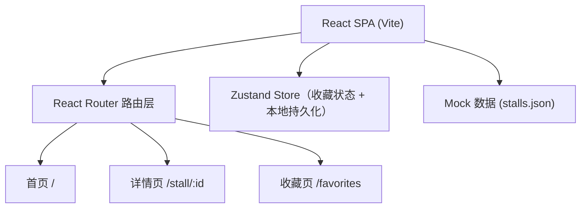
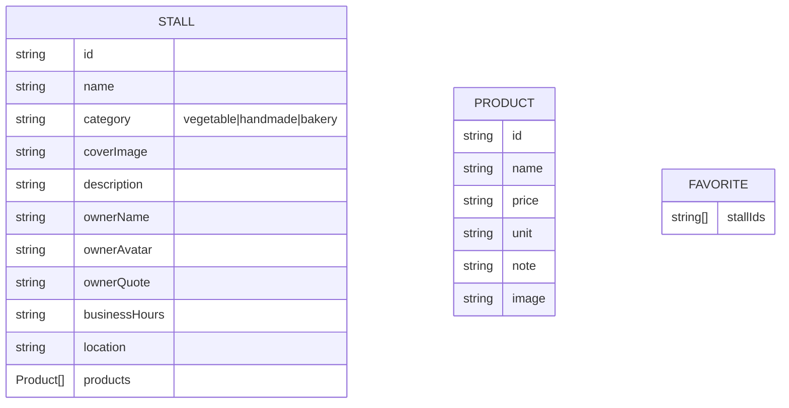

## 1. 架构设计

纯前端单页应用，数据由本地 JSON Mock 驱动，状态通过 Zustand 管理（含 localStorage 持久化收藏）。



---

## 2. 技术说明

- **前端**：React@18 + TypeScript + Vite
- **路由**：react-router-dom@6
- **样式**：Tailwind CSS@3（自定义色系 + 衬线字体栈）
- **状态**：Zustand + persist 中间件（localStorage 持久化收藏）
- **图标**：lucide-react
- **后端**：无（纯前端，本地 JSON 模拟数据）
- **数据库**：无（localStorage 存收藏）

---

## 3. 路由定义
| 路由 | 页面组件 | 用途 |
|------|----------|------|
| `/` | Home | 摊位列表 + 搜索 + 筛选 |
| `/stall/:id` | StallDetail | 单个摊位详情 |
| `/favorites` | Favorites | 我收藏的摊位列表 |
| `*` | Home（重定向） | 404 兜底 |

---

## 4. 数据模型

### 4.1 Stall 类型定义



### 4.2 Mock 数据规模
- 摊位总数：≥ 15 条，覆盖三个品类（蔬菜≥6、手作≥5、烘焙≥4）
- 每条摊位含 3~6 个货品
- 图片使用 `text_to_image` API 生成占位图

---

## 5. 项目目录结构

```
src/
├── components/       可复用组件（StallCard, ProductCard, Navbar...）
├── data/             stalls.json 模拟数据
├── hooks/            自定义 hooks（可选）
├── pages/            Home, StallDetail, Favorites
├── store/            useFavoriteStore.ts
├── types/            stall.ts 类型定义
├── utils/            工具函数
├── App.tsx           路由配置
├── main.tsx
└── index.css         Tailwind 入口 + 自定义样式
```
