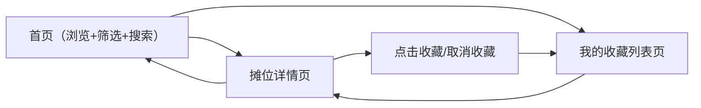

## 1. 产品概述

社区周末农贸市集浏览站，面向小区居民，每月最后一个周末在广场举办一次农贸市集。用户可提前在线浏览本周摊位信息，包括商品品类、摊主信息、营业时间等，并支持收藏感兴趣的摊位。

---

## 2. 核心功能

### 2.1 用户角色
| 角色 | 注册方式 | 核心权限 |
|------|----------|----------|
| 普通居民 | 无需注册 | 浏览摊位、搜索筛选、查看详情、收藏摊位（本地存储） |

### 2.2 功能模块
1. **首页**：顶部导航栏 + 搜索框 + 品类筛选标签 + 摊位卡片网格
2. **摊位详情页**：摊位介绍 + 本周供应货品列表 + 营业时间 + 摊主照片 + 收藏按钮
3. **我的收藏页**：已收藏摊位列表，支持快速跳转详情

### 2.3 页面详情
| 页面名称 | 模块名称 | 功能描述 |
|----------|----------|----------|
| 首页 | 导航栏 | 品牌 Logo、当前市集日期提示、收藏入口按钮 |
| 首页 | 搜索框 | 按摊位名称实时搜索过滤 |
| 首页 | 品类筛选 | 蔬菜、手作、烘焙、全部 四个标签切换筛选 |
| 首页 | 摊位卡片网格 | 响应式卡片布局，显示摊位图、名称、品类标签、简介、收藏态 |
| 详情页 | 摊位头图区 | 大图展示，含返回按钮与收藏按钮 |
| 详情页 | 基本信息 | 摊位名称、品类、营业时间、摊位位置 |
| 详情页 | 摊位介绍 | 富文本描述段落 |
| 详情页 | 本周供应 | 货品卡片列表，含名称、单价/斤、备注说明 |
| 详情页 | 摊主信息 | 摊主头像、姓名、简短寄语 |
| 收藏页 | 空状态 | 无收藏时的引导卡片 |
| 收藏页 | 收藏列表 | 缩略卡片列表，支持移除收藏与跳转详情 |

---

## 3. 核心流程

用户主要浏览流程：进入首页 → 按品类筛选或搜索摊位 → 点击卡片进入详情 → 点击收藏 → 返回首页或进入收藏列表查看已收藏摊位。

---

## 4. 用户界面设计

### 4.1 设计风格
- **主色调**：米白底 `#FAF6EF`（温暖自然）
- **强调色**：深绿 `#2D5A3D`（农场蔬菜感）、土黄 `#C89B4A`（麦穗质感）
- **字体**：衬线字体为主（标题：Noto Serif SC / Lora，正文搭配衬线体）
- **卡片**：圆角 `16px`，细腻阴影，hover 轻微上浮 + 阴影加深
- **按钮**：圆角胶囊形，深绿填充为主要按钮，土黄描边为次要按钮
- **图标风格**：线性 lucide 图标，统一 `strokeWidth=1.75`

### 4.2 页面设计概览
| 页面名称 | 模块名称 | UI 元素 |
|----------|----------|---------|
| 首页 | Hero 标题区 | 衬线大号标题「本月周末市集」，日期土黄高亮，小副标 |
| 首页 | 筛选区 | 搜索框居左（带放大镜图标），品类标签居右（胶囊形，选中深绿填充） |
| 首页 | 卡片网格 | 3 列桌面 / 2 列平板 / 1 列手机，卡片图上叠品类标签色带 |
| 详情页 | 顶部大图 | 占满宽度圆角图，左角返回按钮，右角心形收藏按钮 |
| 详情页 | 信息排版 | 两栏：左文（介绍+供应），右图+营业时间卡（桌面端） |
| 收藏页 | 列表区 | 横向卡片，左缩略图，中信息，右操作按钮组 |

### 4.3 响应式
- Desktop-first 设计，断点：`1024px`（平板两列）、`640px`（手机单列堆叠）
- 触控区域不小于 `44px`，移动端字号自适应缩小 1 级
